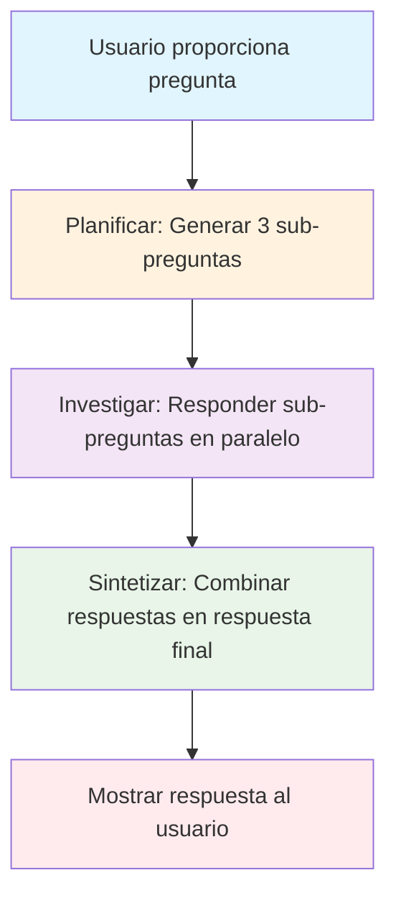
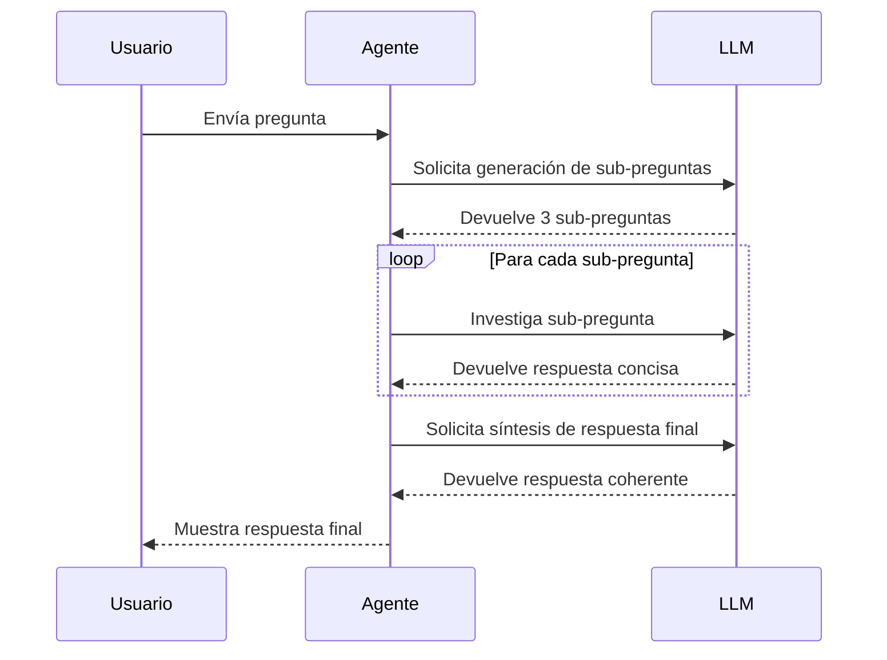
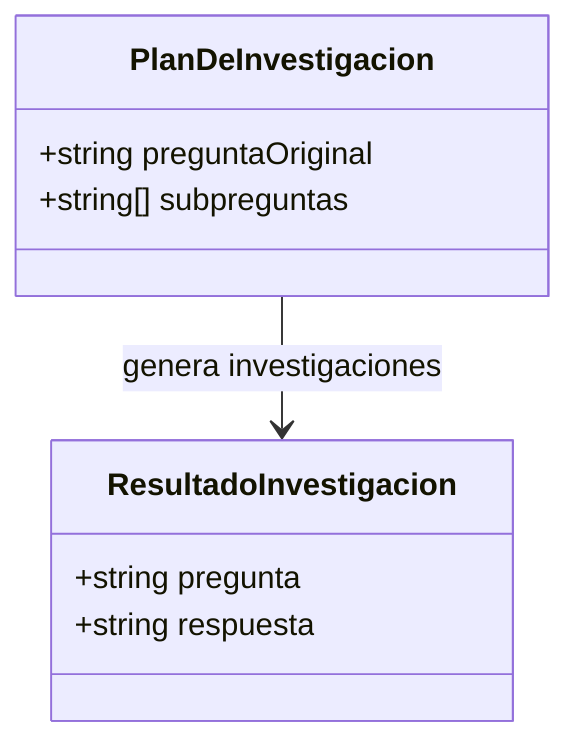

# Agente Investigador: Explicación Detallada

## Introducción

El agente investigador es un sistema automatizado diseñado para responder preguntas complejas de manera estructurada y eficiente. Utiliza modelos de lenguaje avanzados (como Claude o DeepSeek) para dividir una pregunta en componentes manejables, investigar cada parte y sintetizar una respuesta coherente. Este enfoque permite obtener respuestas profundas y bien fundamentadas, aprovechando las capacidades de los LLMs para el análisis y la síntesis.

El agente sigue un patrón de tres pasos: **Planificar**, **Investigar** y **Sintetizar**. Está implementado en TypeScript y se ejecuta desde la línea de comandos mediante scripts npm.

## Cómo Funciona el Agente

### Arquitectura General

El agente está compuesto por varios módulos en la carpeta `agentes/agente-investigador/`:

- **`types.ts`**: Define las interfaces de datos (`PlanDeInvestigacion` y `ResultadoInvestigacion`).
- **`index.ts`**: Orquestador principal que coordina los tres pasos.
- **`planificar.ts`**: Genera un plan de investigación dividiendo la pregunta en sub-preguntas.
- **`investigar.ts`**: Investiga cada sub-pregunta de forma paralela.
- **`sintetizar.ts`**: Combina los resultados en una respuesta final.
- **`../shared/llm-client.js`**: Cliente abstracto para interactuar con proveedores de LLM (Claude o DeepSeek).

### Paso 1: Planificación

En este paso, el agente toma la pregunta original del usuario y la desglosa en exactamente 3 sub-preguntas específicas. Esto se hace consultando al modelo de lenguaje con un prompt que solicita preguntas relevantes para responder completamente la consulta inicial.

**Propósito**: Dividir el problema complejo en partes más pequeñas y manejables, asegurando una cobertura completa.

### Paso 2: Investigación

Cada sub-pregunta se investiga de manera independiente y en paralelo. El agente envía cada una al modelo de lenguaje, pidiendo respuestas concisas (máximo 3-4 oraciones). Los resultados se recopilan en una lista de objetos que contienen la pregunta y su respuesta.

**Propósito**: Obtener información detallada sobre cada aspecto de la pregunta, optimizando el tiempo mediante paralelización.

### Paso 3: Síntesis

Finalmente, el agente combina toda la información recopilada (pregunta original + respuestas a sub-preguntas) y solicita al modelo de lenguaje que genere una respuesta coherente y natural. La síntesis evita mencionar los pasos internos, presentando una explicación fluida al usuario.

**Propósito**: Integrar los hallazgos en una narrativa unificada, eliminando redundancias y asegurando claridad.

### Ejecución y Configuración

- **Ejecución**: Se lanza con comandos como `npm run agente:investigador:claude` o `npm run agente:investigador:deepseek`.
- **Proveedor LLM**: Seleccionado vía variable de entorno `LLM_PROVIDER` (por defecto, Claude).
- **API Keys**: Configuradas en un archivo `.env` para seguridad.
- **Manejo de Errores**: Incluye try/catch para degradación graceful y logs detallados.
- **Tiempo**: Mide y reporta el tiempo total de ejecución.

## Diagramas Mermaid

### Diagrama de Flujo del Proceso

### Diagrama de Secuencia de Interacciones

### Diagrama de Estructura de Datos

## Conclusión

El agente investigador es un ejemplo de cómo los LLMs pueden ser utilizados en patrones estructurados para tareas complejas. Su diseño modular y paralelizado lo hace eficiente y escalable. Para modificaciones o extensiones, consulta los archivos en `agentes/agente-investigador/` y sigue las reglas de estilo definidas en `AGENTS.md`.

Si necesitas ejecutar el agente o hacer cambios, asegúrate de tener configuradas las variables de entorno y las dependencias instaladas.