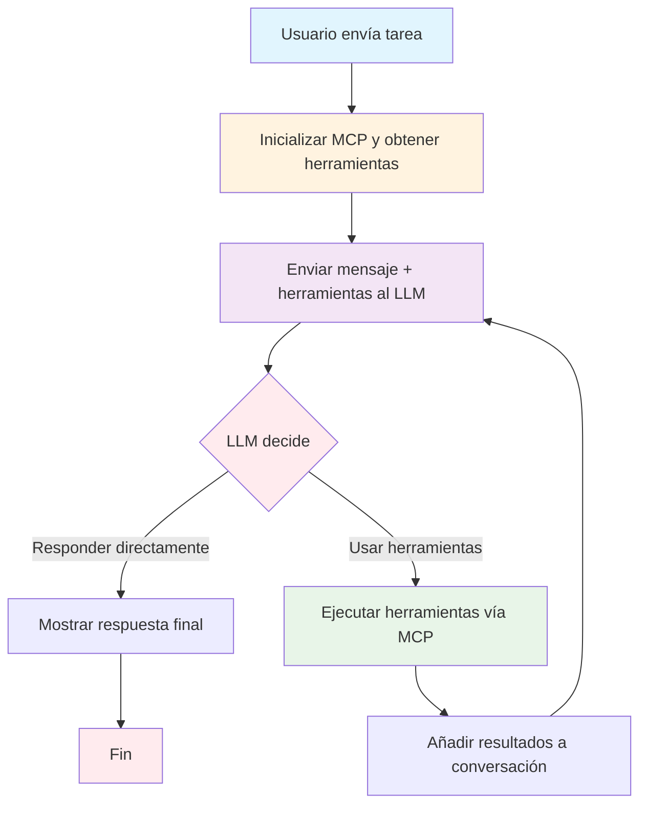
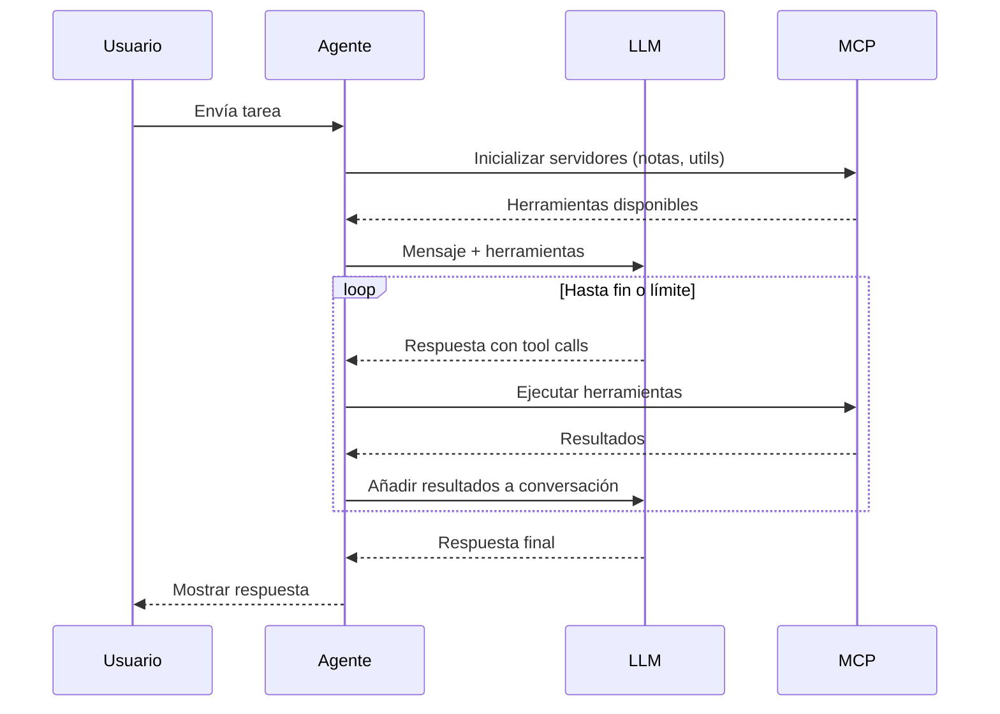
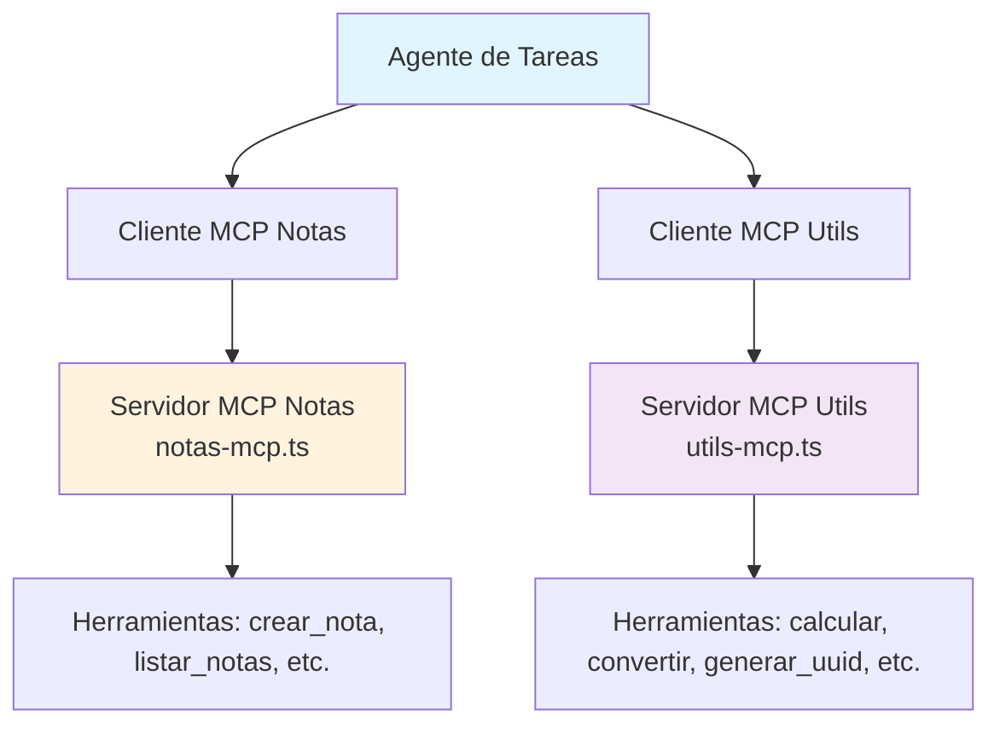

# Agente de Tareas: Explicación Detallada

## Introducción

El agente de tareas es un sistema automatizado que utiliza modelos de lenguaje (como Claude o DeepSeek) para ejecutar tareas complejas mediante el uso de herramientas externas. Integra servidores MCP (Model Context Protocol) para acceder a funcionalidades como gestión de notas y utilidades matemáticas/generación de datos. El agente opera en un bucle de "pensar y actuar", permitiendo al LLM razonar sobre tareas y ejecutar acciones reales a través de herramientas.

Este agente sigue un patrón de bucle con llamadas a herramientas, manejo de estado de conversación y integración MCP, diseñado para tareas prácticas como crear notas, realizar cálculos o generar UUIDs.

## Cómo Funciona el Agente

### Arquitectura General

El agente está compuesto por varios módulos en la carpeta `agentes/agente-tareas/`:

- **`index.ts`**: Punto de entrada principal que inicializa los clientes MCP y ejecuta ejemplos de tareas.
- **`agent-loop.ts`**: Implementa el bucle principal del agente, manejando la conversación con el LLM y la ejecución de herramientas.
- **`tools.ts`**: Gestiona la integración con servidores MCP, obtiene herramientas disponibles y ejecuta llamadas a herramientas.
- **`../shared/llm-client.js`**: Cliente abstracto para interactuar con proveedores de LLM.
- **`../../mcp-client.js`**: Clientes para servidores MCP (notas y utils).

### Inicialización

- El agente inicializa dos clientes MCP: uno para "notas" (gestión de notas encriptadas) y otro para "utils" (utilidades como cálculos, conversiones y generación de datos).
- Si los MCP fallan, usa herramientas simuladas como fallback.
- Obtiene la lista de herramientas disponibles de los servidores MCP.

### Bucle del Agente

El corazón del agente es un bucle que:

1. **Envía el mensaje del usuario al LLM** junto con las herramientas disponibles.
2. **El LLM decide**: Puede responder directamente (fin del bucle) o solicitar el uso de herramientas.
3. **Si solicita herramientas**: El agente ejecuta cada herramienta vía MCP, recopila los resultados y los añade a la conversación.
4. **Continúa el bucle** hasta que el LLM indique el fin o se alcance el límite de iteraciones (máximo 10).

**Propósito**: Permitir al LLM "pensar" y "actuar" iterativamente, ejecutando tareas reales como crear notas o calcular valores, manteniendo el contexto de la conversación.

### Ejecución de Herramientas

- Las herramientas se obtienen dinámicamente de los servidores MCP.
- Cada herramienta tiene un nombre prefijado (ej. `notas_crear_nota`, `utils_calcular`).
- La ejecución se enruta al servidor MCP correspondiente, y los resultados se devuelven como texto.
- Incluye manejo de errores y fallbacks para herramientas simuladas.

### Ejemplos de Uso

El agente se demuestra con tareas como:

- Crear notas con contenido específico.
- Generar UUIDs y almacenarlos en notas.
- Realizar cálculos matemáticos y conversiones de unidades.

### Configuración y Ejecución

- **Ejecución**: `npm run agente:tareas:claude` o `npm run agente:tareas:deepseek`.
- **Proveedor LLM**: Seleccionado vía `--provider` o `LLM_PROVIDER`.
- **MCP Servers**: Ejecutados con `npm run mcp:notas` y `npm run mcp:utils`.
- **Manejo de Errores**: Try/catch para fallos en MCP, con logs detallados.
- **Límite de Iteraciones**: Máximo 10 para evitar bucles infinitos.

## Diagramas Mermaid

### Diagrama de Flujo del Bucle del Agente

### Diagrama de Secuencia de Interacciones

### Diagrama de Integración MCP

## Conclusión

El agente de tareas demuestra cómo integrar LLMs con herramientas externas vía MCP para ejecutar tareas prácticas. Su bucle de tool-calling permite razonamiento iterativo y acciones reales, haciendo posible automatizar flujos de trabajo complejos. Para extensiones, añade más servidores MCP o herramientas simuladas en `tools.ts`.

Si necesitas ejecutar el agente o modificar su comportamiento, revisa los archivos en `agentes/agente-tareas/` y las reglas en `AGENTS.md`.
